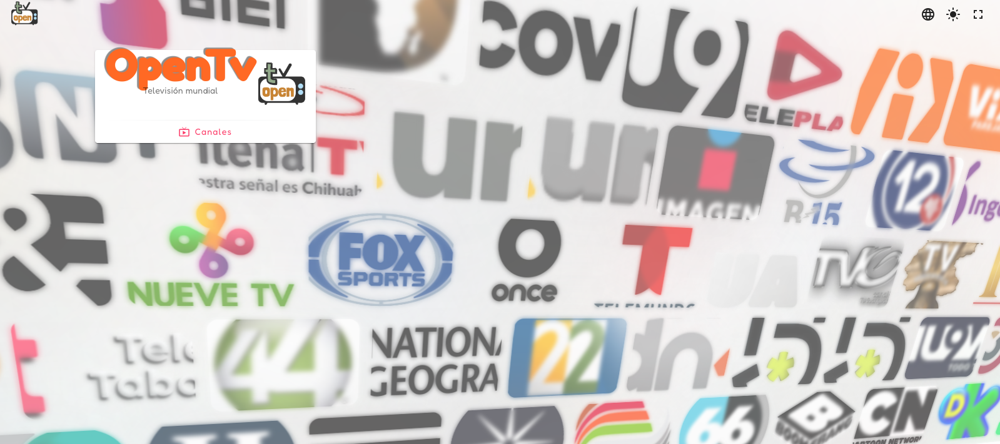
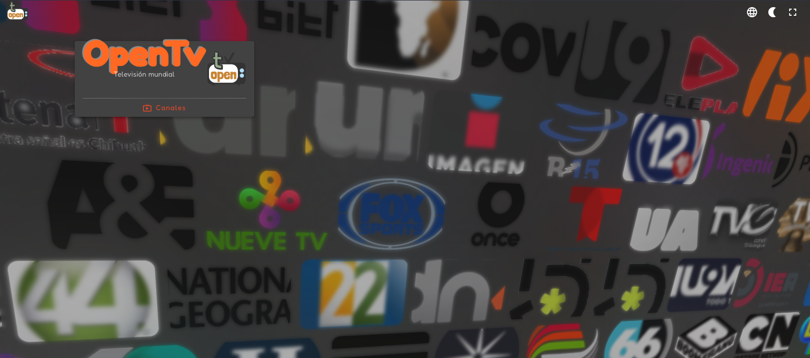
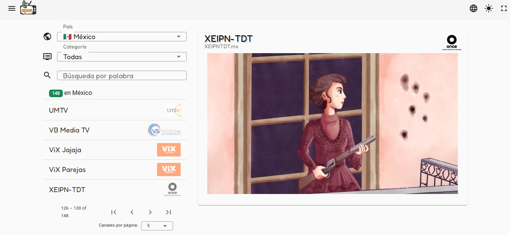
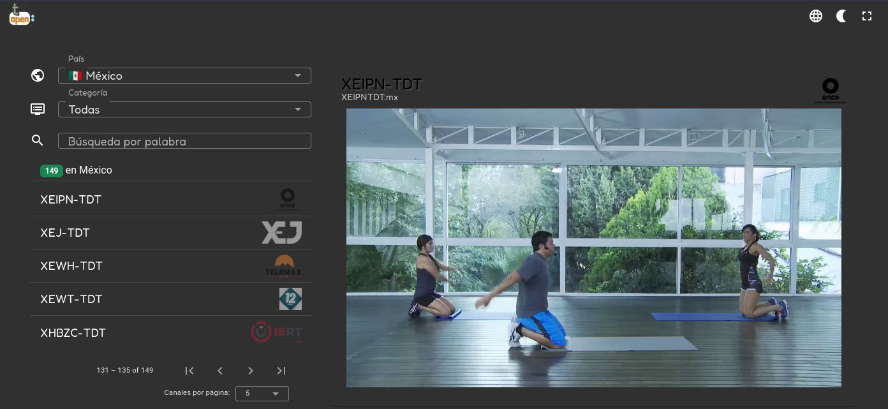
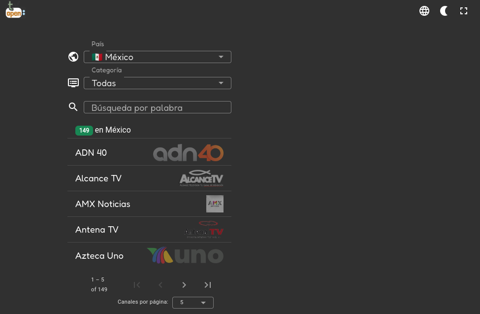
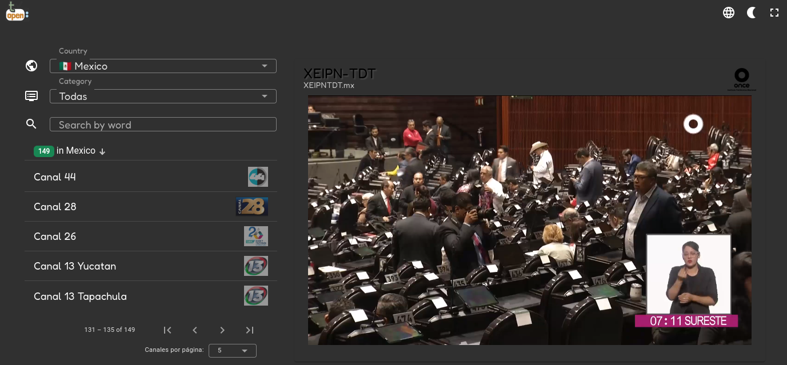

<h1> OpenTv </h1>

OpenTv is an IPTV client web app for searching and playing IPTV channels all around the world. (Vistit [openTv](https://opentv.web.app/) )

## Features

- 🔥 Hosted on Firebase
- 🪤 NGRX state management
- 📐 Responsive design whit Angular Material 16
- 📱 Progressive Web App (PWA)
- 🌜 Dark mode
- 🔎 Search by name, country, category, language, etc.

## Screanshots

## License

See [LICENSE](LICENSE)
